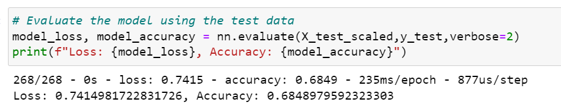
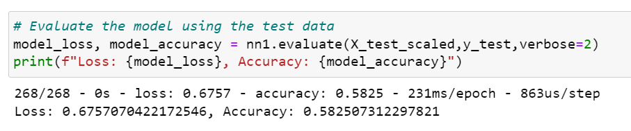
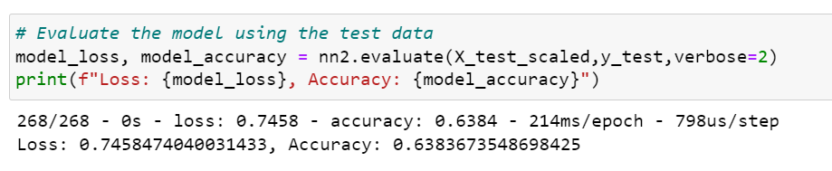
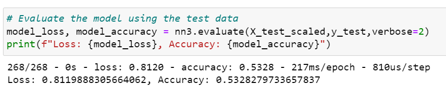

# Neural Network Charity Analysis
## Overview
Using machine learning and neural networks, we predict whether applicants will be successful if funded by Alphabet Soup. From Alphabet Soup’s business team, we received a CSV containing more than 34,000 organizations that have received funding from Alphabet Soup over the years. Using knowledge of TensorFlow, we design a neural network, or deep learning model, to create a binary classification model that can predict if an Alphabet Soup–funded organization will be successful based on the features in the dataset. 

## Results
### Data Preprocessing
Within this dataset are a number of columns that capture metadata about each organization, such as the following: 

- EIN and NAME—Identification columns
- APPLICATION_TYPE—Alphabet Soup application type
- AFFILIATION—Affiliated sector of industry
- CLASSIFICATION—Government organization classification
- USE_CASE—Use case for funding
- ORGANIZATION—Organization type
- STATUS—Active status
- INCOME_AMT—Income classification
- SPECIAL_CONSIDERATIONS—Special consideration for application
- ASK_AMT—Funding amount requested
- IS_SUCCESSFUL—Was the money used effectively

- What variable(s) are considered the target(s) for your model?
    - The target variable is the "IS_SUCCESSFUL" column for our model since we are trying to determine which investments will be successful.

- What variable(s) are considered to be the features for your model?
    - The following columns "APPLICATION_TYPE", "AFFILIATION", "CLASSIFICATION", "USE_CASE", "ORGANIZATION", "STATUS", "INCOME_AMT", "SPECIAL_CONSIDERATIONS", "ASK_AMT" are the features for the model.
- What variable(s) are neither targets nor features, and should be removed from the input data? 
    - The columns "EIN" and "NAME" are removed from the input data since they are identification columns.

### Compiling, Training, and Evaluating the Model
- How many neurons, layers, and activation functions did you select for your neural network model, and why?
    - For my neural network model, it had 2 hidden layers. My first layer had 8 neurons while the second layer has 5 neurons. The first and second hidden layers use the "ReLU" activation function while the output layer uses "sigmoid" since the output is binary.

- Were you able to achieve the target model performance?
    - The model accuracy was 68.49% which is under 75% (target model performance).

        

- What steps did you take to try and increase model performance?
    - Optimization Attempt #1: Reduced epochs to 50 - accuracy decreased to 58.25%

        

    - Optimization Attempt #2: Increased neurons to 80 and 30 - accuracy decreased to 63.84%

        

    - Optimization Attempt #3: Used 3 Hidden layers (80, 30, and 15) - accuracy decreased to 53.28%

        

## Summary
After three attempts at optimizing the model, I was unable to achieve 75% accuracy. Finding the optimal number of layers and neurons could increase the accuracy. In addition, adding or removing more features could also benefit the accuracy.